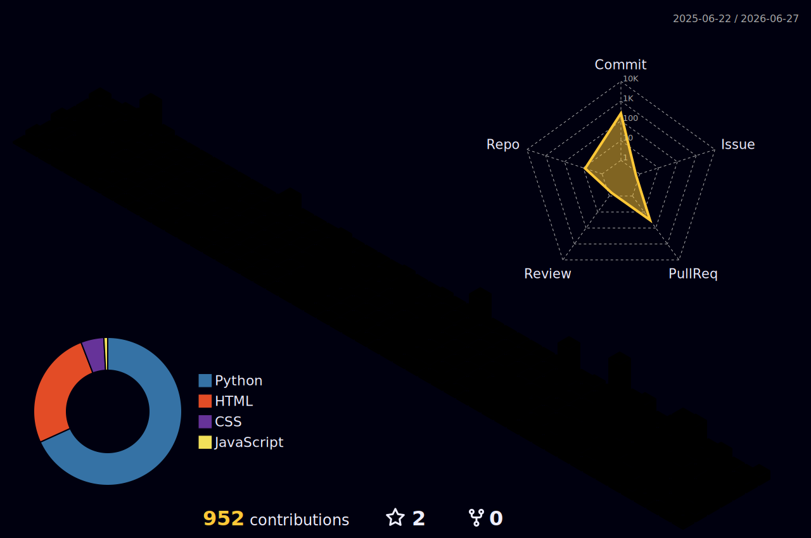

  

<h3 align="center">Backend Developer · Python · Django · DevOps</h3>

  📍 Jauru - MT · 📧 kaioherculano12@gmail.com · <a href="https://www.linkedin.com/in/kaio-herculano-0063932ba">LinkedIn</a>

---

## 👋 Sobre Mim

Desenvolvedor Backend com experiência em **Python**, **Django**, **DRF** e **FastAPI**. Atuo no desenvolvimento de APIs RESTful escaláveis, CI/CD, testes automatizados e infraestrutura com **Docker**, **AWS** e **Cloudflare**. Atualmente estudante de **Engenharia da Computação** e Mentor Backend na **Lacrei Saúde**.

---

|  |  |
| ----------- | ----------- |

---

## 🛠️ Skills

  

  

  

---

## 🌱 Estudando Atualmente

- IA Generativa: LangChain, LlamaIndex
- Docker avançado, AWS, CI/CD pipelines
- Infrastructure as Code (Terraform)
- Clean Architecture e boas práticas

---

## 💼 Experiência

**Mentor Backend** — Lacrei Saúde *(nov/2025 – atual)*  
**Backend Júnior** — Lacrei Saúde *(ago/2025 – nov/2025)*

---

  Feito com 💙 e ☕ por Kaio Herculano

